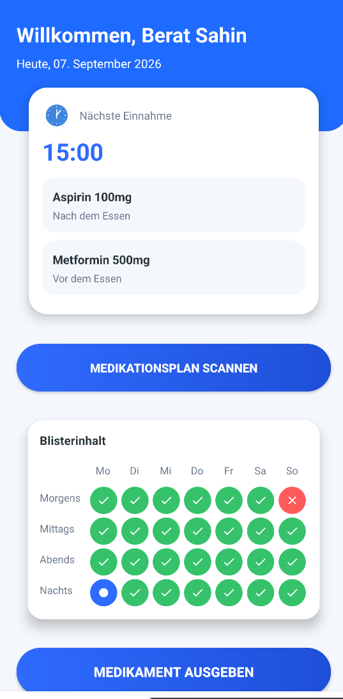
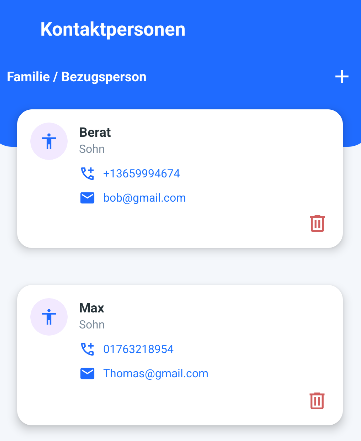
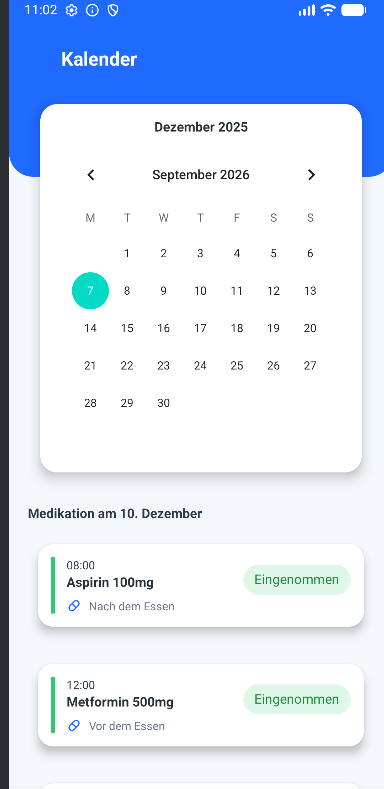
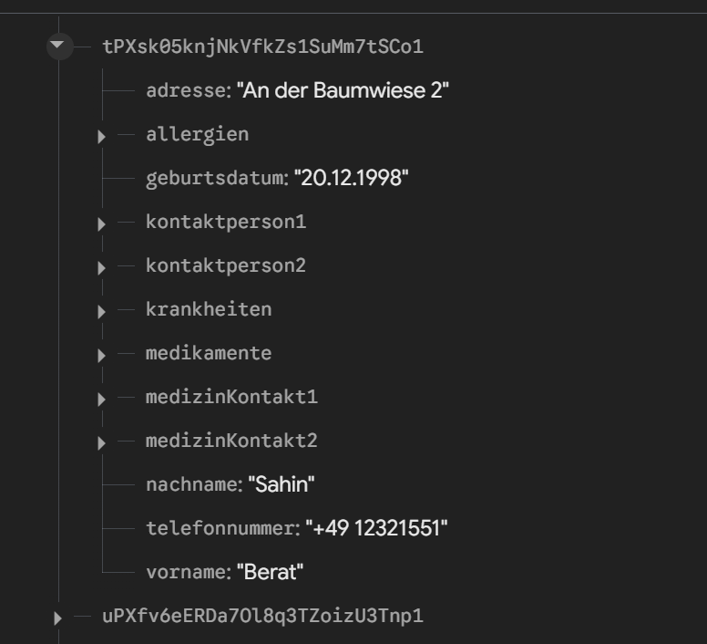

# Medication Dispenser Companion

An Android prototype for managing a personal medication profile. The app combines Firebase-backed account and profile data with medication, allergy, condition, and contact management plus Data Matrix scanning.

> **Prototype notice:** This project is a portfolio and learning prototype. It is not a medical device, does not provide medical advice, and must not be relied on for treatment or medication decisions.

## Overview

The app was created as a German-language companion interface for a medication dispenser concept. Users can register, maintain health-related profile information, store medication and contact entries, and scan Data Matrix codes. Firebase Authentication and Realtime Database provide the current backend.

The repository intentionally represents the implemented state: the calendar is currently a visual prototype, the vacation flow is not yet connected to scheduling logic, and scan results are displayed as raw content rather than imported automatically.

## Features

- Email and password registration and sign-in with Firebase Authentication
- Firebase Realtime Database persistence scoped by authenticated user ID
- Personal profile data editing with input validation
- Add, view, and remove medications, allergies, and medical conditions
- Manage personal emergency contacts and medical contacts
- Data Matrix scanning with copy-to-clipboard support
- Dashboard with the current date and a simple fixed-time next-dose indicator
- German-language XML-based Android interface with Material components

## Screenshots

The screens below show the prototype with fictional test data. The app was never used in production and the displayed names, contact details, medication entries, and dates do not represent real patients.

<table>
  <tr>
    <th>Dashboard</th>
    <th>Contacts</th>
    <th>Calendar</th>
  </tr>
  <tr>
    <td align="center" valign="top"></td>
    <td align="center" valign="top"></td>
    <td align="center" valign="top"></td>
  </tr>
</table>

## Technologies

- Kotlin
- Android SDK (minimum API 24, target API 36)
- Android XML layouts and Material Components
- Firebase Authentication
- Firebase Realtime Database
- ZXing Android Embedded
- Gradle Kotlin DSL and version catalogs
- JUnit 4

## Project structure

```text
app/src/main/java/com/example/medikamenten_spender/
  MainActivity.kt          Sign-in flow
  Registrierung.kt        Account registration
  Home.kt                 Dashboard and navigation
  Profil.kt               Profile overview
  Kontaktperson.kt        Personal and medical contacts
  Scanner.kt              Data Matrix scanner
  Patient.kt              Firebase data models and helpers
  Validate.kt             Profile input validation
app/src/main/res/
  layout/                  Android XML screens
  drawable/                Icons, backgrounds, and UI shapes
gradle/libs.versions.toml  Central dependency versions
```

## Firebase data structure

Firebase Realtime Database stores each prototype account as a user-scoped record containing profile fields and nested collections for allergies, conditions, medications, personal contacts, and medical contacts.

<p align="center">
  
</p>

All values visible in this database screenshot are exclusively fictional test data from a non-production prototype. No real patient information is shown.

## Setup

### Requirements

- Android Studio with JDK 17
- Android SDK 36
- A Firebase project with Email/Password Authentication and Realtime Database enabled

### Firebase configuration

1. Create an Android app in the Firebase console using the package name `com.example.medikamenten_spender`.
2. Download its `google-services.json` file.
3. Place the file at `app/google-services.json`.
4. Configure Realtime Database security rules so authenticated users can access only their own record under `patienten/{uid}`.

The real Firebase configuration is intentionally excluded from Git. A redacted schema example is available at `app/google-services.example.json`.

### Run the app

1. Open the repository in Android Studio.
2. Let Gradle synchronize the project.
3. Add the Firebase configuration described above.
4. Run the `app` configuration on an Android device or emulator with a camera.

Without `app/google-services.json`, local unit tests can still run, but Firebase features cannot start.

## Tests

Run the JVM unit tests with:

```bash
./gradlew testDebugUnitTest
```

The current tests cover the reusable profile validation logic. Firebase integration and UI flows are not yet covered by automated tests.

## What I learned

This project demonstrates Android activity navigation, XML interface construction, validation, asynchronous Firebase operations, user-scoped data modeling, and camera-based barcode scanning. It also highlights practical concerns around handling personal health information and keeping environment-specific backend configuration out of source control.

## Status

**Prototype / work in progress**

The main account and profile-management flows are implemented. Calendar behavior, vacation scheduling, scan-to-medication parsing, production-grade privacy controls, and broader automated test coverage remain future work.

## Possible next steps

- Move Firebase access into repository classes and introduce a clearer presentation architecture
- Add Firebase Emulator Suite integration tests and UI tests
- Connect stored medication schedules to the dashboard and calendar
- Parse supported medication code formats instead of displaying only raw scan data
- Add explicit consent, deletion, and data-retention flows before handling real health data
- Improve accessibility and localize all user-facing strings through Android resources
